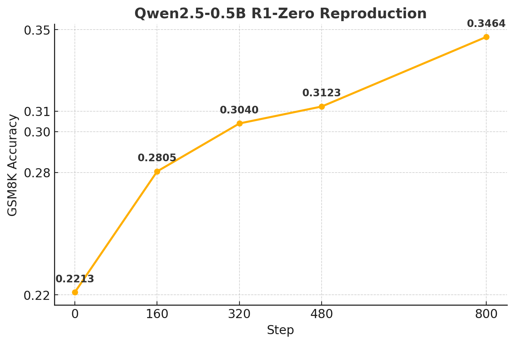
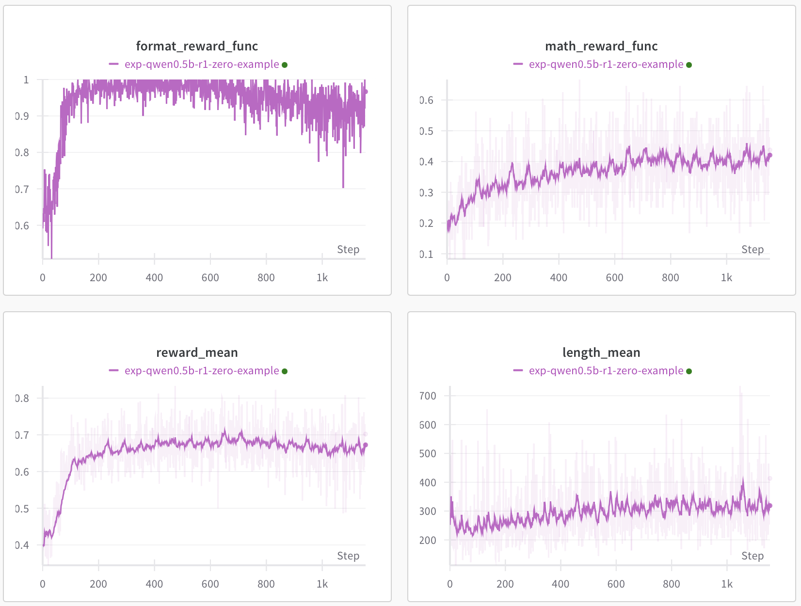

# Simple-R1

A **hackable, simple, and efficient** DeepSeek R1-Zero Reproduction with high speed weight synchronization in a multinode environment.

## Features

- **High-Speed Weight Synchronization between Training Process and Inference Workers**
  Unlike traditional RLHF frameworks (e.g., Open-R1), which combine training and inference within a single process—leading to high memory overhead—**Simple-R1 decouples inference from training**.
  We achieve **extremely fast weight updates** for vLLM-based inference workers via **direct NCCL communication** among distributed nodes.
- **High-Performance Inference with Ray Serve**
  Ray Serve is a high-performance, scalable serving framework that provides load balancing for inference workers.
  We use Ray Serve to efficiently sample generated text from vLLM.
- **Hackable**: No Hugging Face Trainer. You can fully customize your training loop.
- **Simple**: Minimal abstraction, minimal files, minimal dependencies.

## Architecture


## TODO
- [X] Implement a basic training loop to reproduce for DeepSeek R1-Zero.
- [X] Implement high-speed weight synchronization using NCCL between training and inference nodes.
- [ ] Improve code readability, enhance documentation, and refactor the code.
- [ ] Test distributed training with multiple training and inference nodes.
- [ ] Test and support large models.


## R1 Zero Simple Reproduction

### GSM8K (Qwen2.5-0.5B)





| Model | description | GSM8K |
| --- | --- | --- |
| Qwen.2.5-0.5B | Qwen2.5-0.5B baseline | TBU |
| Qwen.2.5-0.5B-r1-zero-oneshot-800step | r1-zero training with Qwen2.5-0.5B with oneshot example | 0.3464 |


## Working Environment

- Python 3.10
- PyTorch 2.5.1
- CUDA Toolkit 12.1 ~ 12.4  
  - (Due to vLLM and Ray compatibility issues, CUDA versions must be between 12.1 and 12.4.)

## Installation

### Install PyTorch
```bash
pip install torch==2.5.1 torchvision==0.20.1 torchaudio==2.5.1 --index-url https://download.pytorch.org/whl/cu121
pip install -r requirements.txt
```

## Training the Model

### Single Node Setup

(TBU)

### 1 Training Node, N Inference Nodes Setup

One node for training, multiple nodes for inference workers.

#### Setting Up Inference Workers

##### Step 1. Launch Ray Master

```bash
RAY_MASTER_PORT=1234
RAY_DASHBOARD_PORT=2345
RAY_CLIENT_SERVER_PORT=3456

RAY_HEAD_NODE_ONLY=1 ray start --head \
    --port=$RAY_MASTER_PORT \
    --num-gpus=0 \
    --num-cpus=0 \
    --min-worker-port=13000 \
    --max-worker-port=14000 \
    --dashboard-port=$RAY_DASHBOARD_PORT \
    --ray-client-server-port=$RAY_CLIENT_SERVER_PORT \
    --resources '{"head": 1}'
```

##### Step 2. Attach Inference Workers to Ray Master

The inference worker nodes must connect to the Ray Master.

```bash
# On an Inference Worker Node
ray start --address="$RAY_MASTER_ADDRESS:$RAY_MASTER_PORT" --block
```

##### Step 3. Launch Inference Workers

```bash
# On the Master Node
export MODEL_NAME_OR_PATH="Qwen/Qwen2.5-0.5B"
export NUM_INFER_WORKERS=8
serve run infer_workers:inference_app
```

##### Step 4. Launch Training

Master node of trainig Node and Master node of Ray must be the same node.

```bash
# At Master Node

# Configure Accelerate for Training
accelerate config

# Run Training
./exps/exps/exp-qwen0.5b-r1-zero-example/run_train.sh
```

### N Training Nodes, K Inference Nodes Setup

(TBU)


