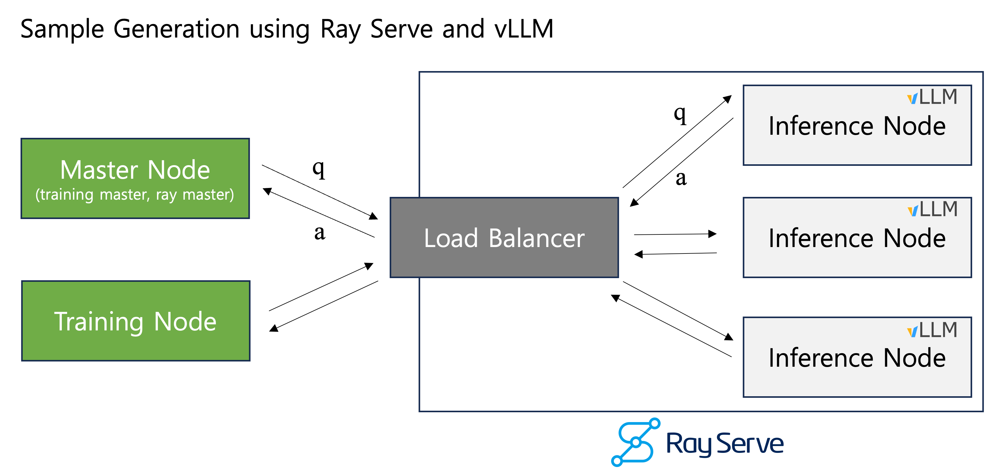
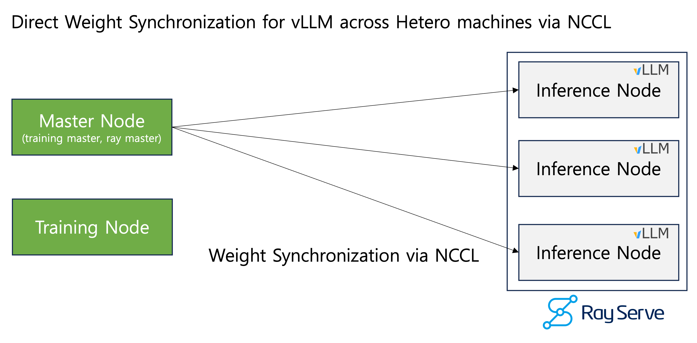

# RLYX 

A **hackable, simple, and reseach-friendly** GRPO Training Framework with high speed weight synchronization in a multinode environment.

> **Note**: This project, previously **simple-r1**, has been refactored and renamed to **RLYX** with improved modular architecture using a decorator-based registry system.

## Features

- **High-Speed Weight Synchronization between Training Process and Inference Workers**
  Unlike traditional RLHF frameworks (e.g., Open-R1), which combine training and inference within a single process—leading to high memory overhead—**RLYX decouples inference from training**.
  We achieve **extremely fast weight updates** for vLLM-based inference workers via **direct NCCL communication** among distributed nodes.
- **High-Performance Inference with Ray Serve**
  Ray Serve is a high-performance, scalable serving framework that provides load balancing for inference workers.
  We use Ray Serve to efficiently sample generated text from vLLM.
- **Modular Architecture with Registry Pattern**
  RLYX uses a decorator-based registry system for easy extension and customization of components (rewards, tokenizers, evaluators, etc.).
- **Hackable**: No Hugging Face Trainer. You can fully customize your training loop.
- **Simple**: Minimal abstraction, minimal files, minimal dependencies.

## Architecture




## Project Structure

```
rlyx/
├── registries.py          # Centralized registry system
├── train.py              # Main training script
├── evaluation.py         # Model evaluation
├── infer_workers.py      # Inference workers with Ray Serve
├── arguments.py          # Training arguments
├── utils/                # Utilities and helpers
├── chat_templates/       # Chat templates (registry-based)
├── dataset_loaders/      # Dataset loaders (registry-based)
├── evaluators/           # Model evaluators (registry-based)
├── rewards/              # Reward functions (registry-based)
└── tokenizers/           # Tokenizers (registry-based)
```

## TODO
- [X] Implement a basic training loop to reproduce for DeepSeek R1-Zero.
- [X] Implement high-speed weight synchronization using NCCL between training and inference nodes.
- [X] Improve code readability, enhance documentation, and refactor the code with modular architecture.
- [X] Test distributed training with single training node and single inference nodes.
- [ ] Test distributed training with multiple training and inference nodes.
- [ ] Test and support large models.


## R1 Zero Simple Reproduction

### GSM8K (Qwen2.5-0.5B)


| Model | description | GSM8K |
| --- | --- | --- |
| Qwen.2.5-0.5B  | Qwen2.5-0.5B baseline | 41.6 |
| Qwen.2.5-0.5B-r1-zero-reproduction | r1-zero training with Qwen2.5-0.5B, limitted output length setting(max output length 500)| 47.99 |


## Working Environment

- Python 3.12
- PyTorch 2.5.1
- CUDA Toolkit 12.1 ~ 12.4  
  - (Due to vLLM and Ray compatibility issues, CUDA versions must be between 12.1 and 12.4.)

## Installation

### Install PyTorch
```bash
pip install torch==2.5.1 torchvision==0.20.1 torchaudio==2.5.1 --index-url https://download.pytorch.org/whl/cu121
pip install -r requirements.txt
```

## Extending RLYX

### Adding Custom Components

RLYX uses a decorator-based registry system. To add custom components:

#### Example: Adding a Custom Reward Function

```python
# rlyx/rewards/my_custom_reward.py
from rlyx.registries import REWARD_REGISTRY

@REWARD_REGISTRY.register("my_custom_reward")
def my_custom_reward_func(pred_text: str, gold_text: str, **kwargs) -> float:
    # Your implementation here
    return 1.0
```

Use it in your experiment config:
```yaml
reward_function_names: ["my_custom_reward"]
```

## Training the Model

### Single Node Setup

(TBU)

### 1 Training Node, N Inference Nodes Setup

One node for training, multiple nodes for inference workers.

#### Setting Up Inference Workers

##### Step 1. Launch Ray Master

```bash
# On the Master Node
./exps/exp-gsm8k-qwen-2.5-0.5b-base-example/prep_01_start_ray_on_master.sh

```

##### Step 2. Attach Inference Workers to Ray Master

The inference worker nodes must connect to the Ray Master.

```bash
# On the Inference Worker Node
ray start --address="$RAY_MASTER_ADDRESS:$RAY_MASTER_PORT" --block
```

##### Step 3. Launch Inference Workers

```bash
# On the Master Node
./exps/exp-gsm8k-qwen-2.5-0.5b-base-example/prep_02_start_serve_on_master.sh
```

##### Step 4. Launch Training

Master node of trainig Node and Master node of Ray must be the same node.

```bash
# At Master Node

# Configure Accelerate for Training
accelerate config

# Run Training
./exps/exp-gsm8k-qwen-2.5-0.5b-base-example/run_train.sh
```

##### Termination

```
# on the master node
# kill the training process
ps -ef | grep "[p]ython -m rlyx.train" | awk '{print $2}' | xargs kill -9

# stop the Ray serve
ray stop
```

### N Training Nodes, K Inference Nodes Setup

(TBU)

```bibtex
@misc{kim2025rlyx,
      title={RLYX: A Hackable, Simple, and Research Friendly RL Framework with High-Speed Weight Synchronization}, 
      author={Sungju Kim},
      year={2025},
      url={}, 
}
```
